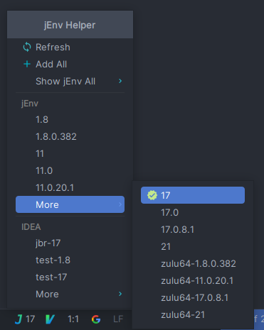

jEnv Helper
===========

**This is a project I just started to learn Intellij plugin development, some code may be written with some problems.**

<!-- Plugin description -->

## This is a jEnv plugin for IntelliJ IDEA

> [jEnv](https://www.jenv.be) is a command line tool to help you forget how to set the JAVA_HOME environment variable. 
> jEnv source code: https://github.com/jenv/jenv

- Auto switch IDEA JDK.
- Add All jEnv JDK option, rename IDEA SDK when some names are same with jEnv JDK.
- Listening the change of project jEnv version file `.java-version` and change this project JDK.
- Change project JDK by status bar, when jEnv version file does not exist in this project, show message dialog to create jEnv version file in this project.

## 🔔️ Notice
After IDEA is opened, use the jenv command to repeatedly remove and add the JDK.  
**This JDK is likely to be unavailable.**  
At this time, it is recommended to restart IDEA to refresh the JDK information.  

## Screenshot

<!-- Plugin description end -->

## License
This project is licensed under the [MIT license](https://github.com/JokingAboutLife/intellij-jenv-plugin/blob/8969efeb61b4cc2aaea465fb07ccac5bbca04272/LICENSE).
